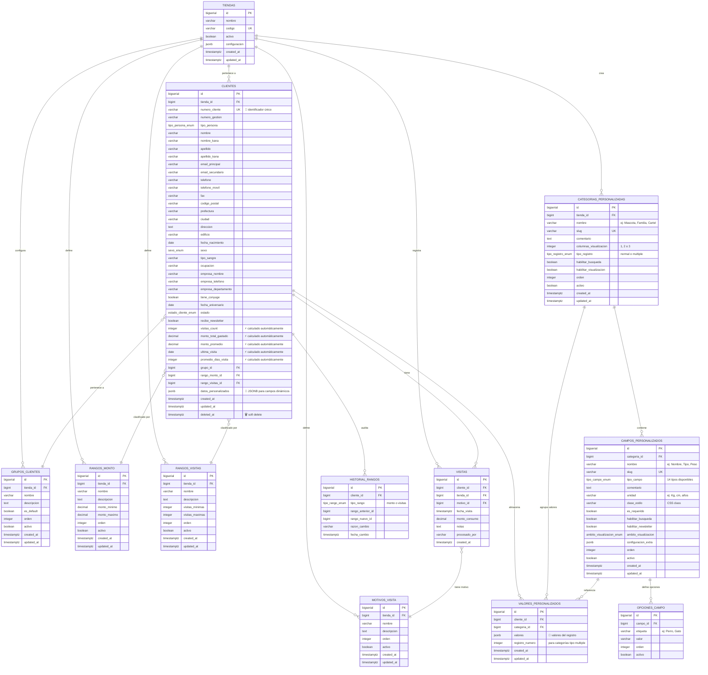
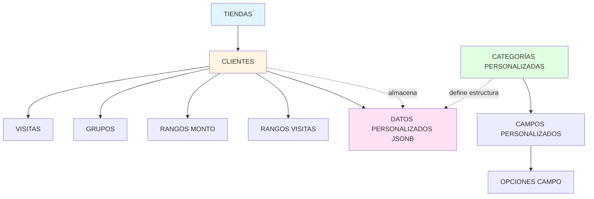
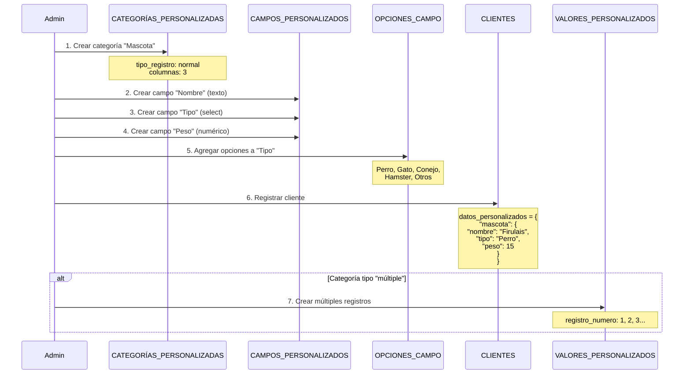
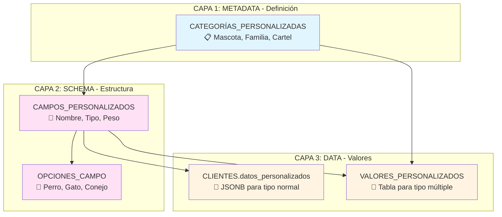
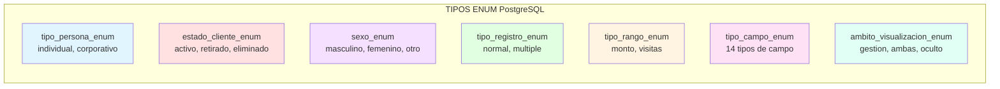
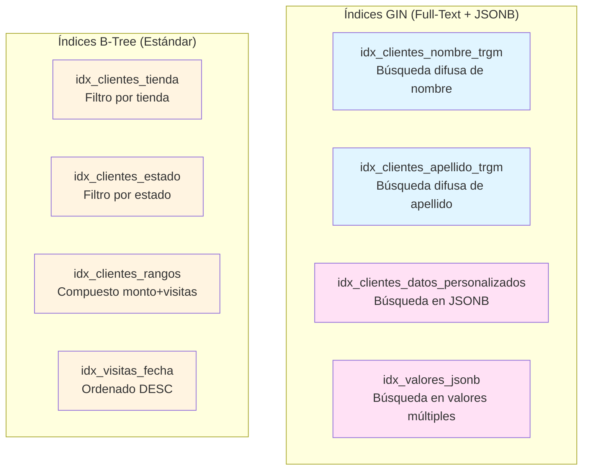
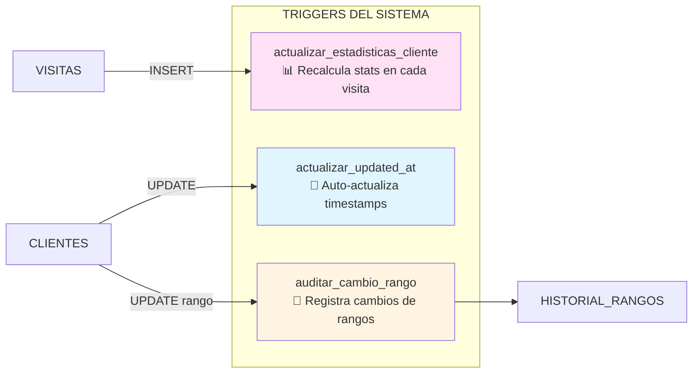

# Diagrama ERD - Base de Datos Módulo Clientes

## Vista Completa del Sistema



---

## Diagrama Simplificado - Core Entities



---

## Flujo de Datos - Campos Personalizados



---

## Diagrama de Arquitectura de 3 Capas



---

## Tipos ENUM del Sistema



### Detalle de tipo_campo_enum (14 tipos)

```
┌─────────────────────────────────────────────────────────┐
│ TIPOS DE CAMPO PERSONALIZADOS                          │
├─────────────────────────────────────────────────────────┤
│ 1.  texto              → Texto simple                  │
│ 2.  email              → Email con validación          │
│ 3.  alfanumerico       → Alfanumérico                  │
│ 4.  numerico           → Número decimal                │
│ 5.  textarea           → Texto largo                   │
│ 6.  checkbox           → Casilla de verificación       │
│ 7.  select             → Lista desplegable             │
│ 8.  radio              → Botones de radio              │
│ 9.  anio               → Solo año (YYYY)               │
│ 10. anio_mes           → Año y mes (YYYY-MM)           │
│ 11. anio_mes_dia       → Fecha completa (YYYY-MM-DD)   │
│ 12. mes_dia            → Mes y día (MM-DD)             │
│ 13. fecha_referencia   → Fecha con referencia          │
│ 14. tabla              → Estructura tabular            │
│ 15. menu               → Menú de opciones              │
└─────────────────────────────────────────────────────────┘
```

---

## Índices Clave del Sistema



---

## Triggers Automáticos



---

## Ejemplo Práctico: Cliente con Mascota

### Estructura de Datos

```json
{
  "cliente_id": 1,
  "nombre": "Juan Pérez",
  "datos_personalizados": {
    "mascota": {
      "nombre": "Firulais",
      "tipo": "Perro",
      "peso": 15
    },
    "familia": {
      "conyuge": "Sí",
      "fecha_aniversario": "2015-06-20"
    }
  }
}
```

### Query para Buscar

```sql
-- Buscar clientes con mascota tipo "Perro"
SELECT 
    id,
    nombre,
    apellido,
    datos_personalizados -> 'mascota' ->> 'nombre' as mascota_nombre,
    datos_personalizados -> 'mascota' ->> 'tipo' as mascota_tipo,
    datos_personalizados -> 'mascota' ->> 'peso' as mascota_peso
FROM clientes
WHERE datos_personalizados -> 'mascota' ->> 'tipo' = 'Perro'
  AND (datos_personalizados -> 'mascota' ->> 'peso')::numeric > 10
  AND estado = 'activo';
```

---

## Estadísticas de Complejidad

```
┌──────────────────────────────────────────────────────┐
│ MÉTRICAS DEL ESQUEMA                                │
├──────────────────────────────────────────────────────┤
│ Tablas totales:              13                     │
│ Tipos ENUM:                  7                      │
│ Foreign Keys:                19                     │
│ Índices GIN:                 6                      │
│ Índices B-Tree:              25+                    │
│ Triggers:                    6                      │
│ Funciones:                   4                      │
│ Constraints CHECK:           8                      │
│ Constraints UNIQUE:          12                     │
├──────────────────────────────────────────────────────┤
│ Campos en tabla CLIENTES:    ~55                    │
│ Tipos de campo dinámicos:    15                     │
│ Categorías de ejemplo:       5 (Mascota, etc.)     │
└──────────────────────────────────────────────────────┘
```

---

## Leyenda de Símbolos

| Símbolo | Significado |
|---------|-------------|
| 📌 | Campo clave/identificador |
| ⚡ | Campo calculado automáticamente |
| 💾 | Almacenamiento JSONB |
| 🗑️ | Soft delete (deleted_at) |
| 🔘 | Opciones predefinidas |
| 📋 | Metadata/configuración |
| 📝 | Definición de estructura |
| 📊 | Estadísticas/métricas |
| 📅 | Timestamp automático |

---

**Creado**: 2026-10-01  
**Autor**: Antony Brahams Paredes Paulino  
**Proyecto**: VivaTech CRM System  
**Base de datos**: PostgreSQL 14+
