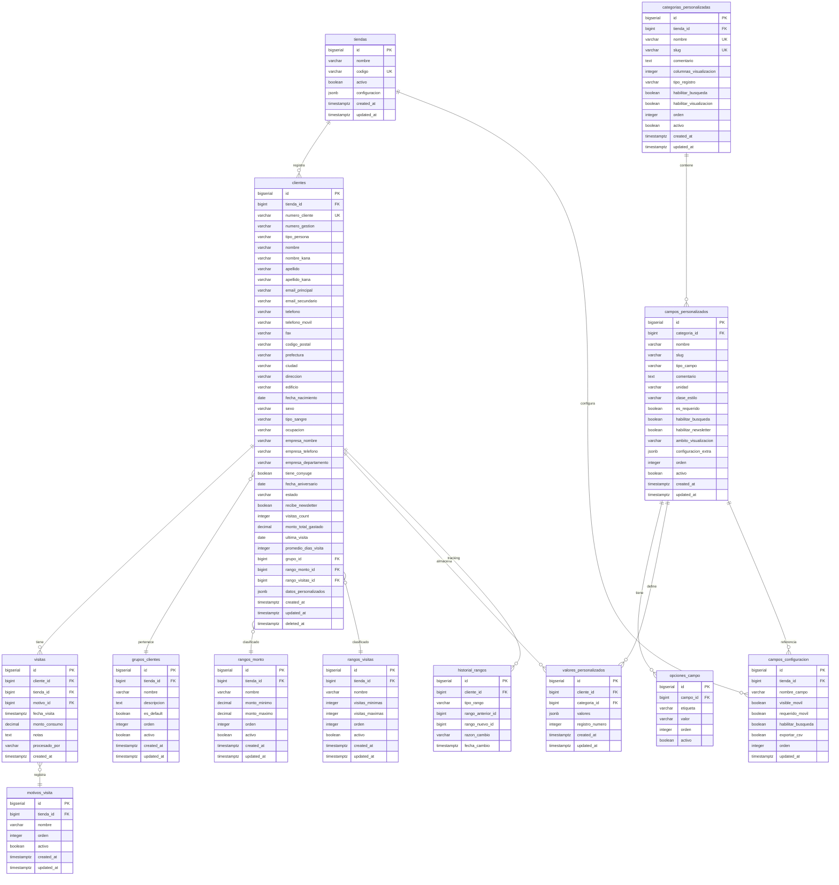

# Esquema de Base de Datos - Módulo de Gestión de Clientes

## Sistema CRM - PostgreSQL Schema

Basado en el análisis completo del sistema legacy documentado en 23 vistas.

---

## 📋 Índice

1. [Visión General](#visión-general)
2. [Diagrama ERD](#diagrama-erd)
3. [Tablas del Sistema](#tablas-del-sistema)
4. [Manejo de Campos Personalizados](#manejo-de-campos-personalizados)
5. [Scripts SQL](#scripts-sql)
6. [Índices y Performance](#índices-y-performance)
7. [Migraciones](#migraciones)

---

## Visión General

### Entidades Principales

```
┌─────────────────────────────────────────────────────────────────┐
│                    MÓDULO DE CLIENTES                           │
├─────────────────────────────────────────────────────────────────┤
│                                                                  │
│  ┌──────────────┐        ┌──────────────┐                      │
│  │   CLIENTES   │◄───────│   TIENDAS    │                      │
│  │  (estándar)  │        │              │                      │
│  └──────┬───────┘        └──────────────┘                      │
│         │                                                        │
│         │                                                        │
│    ┌────┴────┬──────────┬──────────────┬──────────────┐       │
│    │         │          │              │              │        │
│    ▼         ▼          ▼              ▼              ▼        │
│  ┌────┐  ┌──────┐  ┌─────────┐  ┌─────────┐  ┌──────────┐    │
│  │VISI│  │GRUPOS│  │ RANGOS  │  │ CAMPOS  │  │  VALORES │    │
│  │TAS │  │      │  │         │  │PERSONAL.│  │ PERSONAL.│    │
│  └────┘  └──────┘  └─────────┘  └─────────┘  └──────────┘    │
│                                       │              │          │
│                                       └──────┬───────┘          │
│                                              │                  │
│                                       ┌──────▼────────┐         │
│                                       │  CATEGORÍAS   │         │
│                                       │ PERSONALIZADAS│         │
│                                       └───────────────┘         │
└─────────────────────────────────────────────────────────────────┘
```

### Estrategia de Diseño

**Problema:** Campos personalizados dinámicos creados por administradores

**Solución Híbrida:**
1. **Tablas normalizadas** para campos estándar (50 campos fijos)
2. **Metadata tables** para definir campos personalizados (categorías y campos)
3. **JSONB** para almacenar valores de campos personalizados
4. **Tablas pivot** para relaciones many-to-many

**Ventajas PostgreSQL:**
- ✅ Tipo `JSONB` con índices GIN para búsquedas rápidas
- ✅ Validaciones a nivel de BD con `CHECK` constraints
- ✅ Tipos ENUM personalizados
- ✅ Generación de columnas y triggers
- ✅ Full-text search nativo

---

## Diagrama ERD

### Diagrama Completo (Mermaid)



---

## Tablas del Sistema

### 1. Tiendas (shops)

```sql
CREATE TABLE tiendas (
    id BIGSERIAL PRIMARY KEY,
    nombre VARCHAR(255) NOT NULL,
    codigo VARCHAR(50) NOT NULL UNIQUE,
    activo BOOLEAN DEFAULT true,
    configuracion JSONB DEFAULT '{}'::jsonb,
    created_at TIMESTAMPTZ DEFAULT NOW(),
    updated_at TIMESTAMPTZ DEFAULT NOW()
);

COMMENT ON TABLE tiendas IS 'Tiendas/sucursales del sistema';
COMMENT ON COLUMN tiendas.configuracion IS 'Configuraciones específicas de la tienda en formato JSON';
```

### 2. Clientes (customers)

```sql
CREATE TYPE tipo_persona_enum AS ENUM ('individual', 'corporativo');
CREATE TYPE estado_cliente_enum AS ENUM ('activo', 'retirado', 'eliminado');
CREATE TYPE sexo_enum AS ENUM ('masculino', 'femenino', 'otro');

CREATE TABLE clientes (
    id BIGSERIAL PRIMARY KEY,
    tienda_id BIGINT NOT NULL REFERENCES tiendas(id) ON DELETE RESTRICT,
    
    -- Identificación
    numero_cliente VARCHAR(50) NOT NULL UNIQUE,
    numero_gestion VARCHAR(50),
    tipo_persona tipo_persona_enum DEFAULT 'individual',
    
    -- Información Personal
    nombre VARCHAR(255) NOT NULL,
    nombre_kana VARCHAR(255),
    apellido VARCHAR(255),
    apellido_kana VARCHAR(255),
    
    -- Contacto
    email_principal VARCHAR(255),
    email_secundario VARCHAR(255),
    telefono VARCHAR(50),
    telefono_movil VARCHAR(50),
    fax VARCHAR(50),
    
    -- Dirección
    codigo_postal VARCHAR(10),
    prefectura VARCHAR(100),
    ciudad VARCHAR(255),
    ciudad_kana VARCHAR(255),
    direccion TEXT,
    edificio VARCHAR(255),
    edificio_kana VARCHAR(255),
    
    -- Datos Demográficos
    fecha_nacimiento DATE,
    sexo sexo_enum,
    tipo_sangre VARCHAR(5),
    ocupacion VARCHAR(100),
    
    -- Información Laboral (para corporativos)
    empresa_nombre VARCHAR(255),
    empresa_nombre_kana VARCHAR(255),
    empresa_industria VARCHAR(100),
    empresa_telefono VARCHAR(50),
    empresa_fax VARCHAR(50),
    empresa_fecha_fundacion DATE,
    empresa_capital DECIMAL(15, 2),
    empresa_departamento VARCHAR(100),
    empresa_contacto_nombre VARCHAR(255),
    empresa_contacto_telefono VARCHAR(50),
    empresa_contacto_email VARCHAR(255),
    
    -- Información Familiar
    tiene_conyuge BOOLEAN DEFAULT false,
    fecha_aniversario DATE,
    
    -- Estado y Configuración
    estado estado_cliente_enum DEFAULT 'activo',
    recibe_newsletter BOOLEAN DEFAULT true,
    numero_fallos_envio INTEGER DEFAULT 0,
    terminal_id VARCHAR(100),
    
    -- Estadísticas
    visitas_count INTEGER DEFAULT 0,
    monto_total_gastado DECIMAL(15, 2) DEFAULT 0,
    monto_promedio DECIMAL(15, 2) DEFAULT 0,
    ultima_visita DATE,
    promedio_dias_visita INTEGER,
    fecha_proxima_visita_estimada DATE,
    
    -- Clasificación
    grupo_id BIGINT REFERENCES grupos_clientes(id) ON DELETE SET NULL,
    rango_monto_id BIGINT REFERENCES rangos_monto(id) ON DELETE SET NULL,
    rango_visitas_id BIGINT REFERENCES rangos_visitas(id) ON DELETE SET NULL,
    
    -- Campos Personalizados (JSONB)
    datos_personalizados JSONB DEFAULT '{}'::jsonb,
    
    -- Auditoría
    created_at TIMESTAMPTZ DEFAULT NOW(),
    updated_at TIMESTAMPTZ DEFAULT NOW(),
    deleted_at TIMESTAMPTZ,
    
    -- Constraints
    CONSTRAINT email_principal_formato CHECK (email_principal ~* '^[A-Za-z0-9._%+-]+@[A-Za-z0-9.-]+\.[A-Za-z]{2,}$'),
    CONSTRAINT fecha_nacimiento_valida CHECK (fecha_nacimiento <= CURRENT_DATE)
);

-- Índices
CREATE INDEX idx_clientes_tienda ON clientes(tienda_id);
CREATE INDEX idx_clientes_nombre ON clientes(nombre);
CREATE INDEX idx_clientes_email ON clientes(email_principal);
CREATE INDEX idx_clientes_telefono ON clientes(telefono);
CREATE INDEX idx_clientes_estado ON clientes(estado);
CREATE INDEX idx_clientes_grupo ON clientes(grupo_id);
CREATE INDEX idx_clientes_rangos ON clientes(rango_monto_id, rango_visitas_id);
CREATE INDEX idx_clientes_datos_personalizados ON clientes USING gin(datos_personalizados);
CREATE INDEX idx_clientes_deleted_at ON clientes(deleted_at) WHERE deleted_at IS NULL;

COMMENT ON TABLE clientes IS 'Clientes del sistema con campos estándar y personalizados';
COMMENT ON COLUMN clientes.datos_personalizados IS 'Valores de campos personalizados en formato JSONB';
```

### 3. Grupos de Clientes

```sql
CREATE TABLE grupos_clientes (
    id BIGSERIAL PRIMARY KEY,
    tienda_id BIGINT NOT NULL REFERENCES tiendas(id) ON DELETE CASCADE,
    nombre VARCHAR(255) NOT NULL,
    descripcion TEXT,
    es_default BOOLEAN DEFAULT false,
    orden INTEGER DEFAULT 0,
    activo BOOLEAN DEFAULT true,
    created_at TIMESTAMPTZ DEFAULT NOW(),
    updated_at TIMESTAMPTZ DEFAULT NOW(),
    
    CONSTRAINT unique_nombre_tienda UNIQUE(tienda_id, nombre),
    CONSTRAINT unique_default_por_tienda UNIQUE(tienda_id, es_default) WHERE es_default = true
);

CREATE INDEX idx_grupos_tienda ON grupos_clientes(tienda_id);
CREATE INDEX idx_grupos_activo ON grupos_clientes(activo);

COMMENT ON TABLE grupos_clientes IS 'Grupos de categorización de clientes';
```

### 4. Rangos por Monto

```sql
CREATE TABLE rangos_monto (
    id BIGSERIAL PRIMARY KEY,
    tienda_id BIGINT NOT NULL REFERENCES tiendas(id) ON DELETE CASCADE,
    nombre VARCHAR(255) NOT NULL,
    descripcion TEXT,
    monto_minimo DECIMAL(15, 2) DEFAULT 0,
    monto_maximo DECIMAL(15, 2),
    orden INTEGER DEFAULT 0,
    activo BOOLEAN DEFAULT true,
    created_at TIMESTAMPTZ DEFAULT NOW(),
    updated_at TIMESTAMPTZ DEFAULT NOW(),
    
    CONSTRAINT monto_rango_valido CHECK (monto_maximo IS NULL OR monto_maximo >= monto_minimo)
);

CREATE INDEX idx_rangos_monto_tienda ON rangos_monto(tienda_id);
CREATE INDEX idx_rangos_monto_rangos ON rangos_monto(monto_minimo, monto_maximo);

COMMENT ON TABLE rangos_monto IS 'Rangos de clientes basados en monto gastado';
```

### 5. Rangos por Frecuencia de Visitas

```sql
CREATE TABLE rangos_visitas (
    id BIGSERIAL PRIMARY KEY,
    tienda_id BIGINT NOT NULL REFERENCES tiendas(id) ON DELETE CASCADE,
    nombre VARCHAR(255) NOT NULL,
    descripcion TEXT,
    visitas_minimas INTEGER DEFAULT 0,
    visitas_maximas INTEGER,
    orden INTEGER DEFAULT 0,
    activo BOOLEAN DEFAULT true,
    created_at TIMESTAMPTZ DEFAULT NOW(),
    updated_at TIMESTAMPTZ DEFAULT NOW(),
    
    CONSTRAINT visitas_rango_valido CHECK (visitas_maximas IS NULL OR visitas_maximas >= visitas_minimas)
);

CREATE INDEX idx_rangos_visitas_tienda ON rangos_visitas(tienda_id);
CREATE INDEX idx_rangos_visitas_rangos ON rangos_visitas(visitas_minimas, visitas_maximas);

COMMENT ON TABLE rangos_visitas IS 'Rangos de clientes basados en frecuencia de visitas';
```

---

## Manejo de Campos Personalizados

### Arquitectura de 3 Capas

```
┌─────────────────────────────────────────────────────────────┐
│ CAPA 1: DEFINICIÓN DE CATEGORÍAS                           │
│ categorias_personalizadas                                   │
│ (ej: "Mascota", "Cartel", "Familia")                      │
└─────────────────┬───────────────────────────────────────────┘
                  │
                  ▼
┌─────────────────────────────────────────────────────────────┐
│ CAPA 2: DEFINICIÓN DE CAMPOS                               │
│ campos_personalizados + opciones_campo                     │
│ (ej: Mascota → Nombre, Tipo, Peso)                        │
└─────────────────┬───────────────────────────────────────────┘
                  │
                  ▼
┌─────────────────────────────────────────────────────────────┐
│ CAPA 3: VALORES POR CLIENTE                                │
│ clientes.datos_personalizados (JSONB)                      │
│ valores_personalizados (para tipo múltiple)                │
└─────────────────────────────────────────────────────────────┘
```

### 6. Categorías Personalizadas

```sql
CREATE TYPE tipo_registro_enum AS ENUM ('normal', 'multiple');

CREATE TABLE categorias_personalizadas (
    id BIGSERIAL PRIMARY KEY,
    tienda_id BIGINT NOT NULL REFERENCES tiendas(id) ON DELETE CASCADE,
    nombre VARCHAR(255) NOT NULL,
    slug VARCHAR(100) NOT NULL,
    comentario TEXT,
    columnas_visualizacion INTEGER DEFAULT 1 CHECK (columnas_visualizacion BETWEEN 1 AND 3),
    tipo_registro tipo_registro_enum DEFAULT 'normal',
    habilitar_busqueda BOOLEAN DEFAULT true,
    habilitar_visualizacion BOOLEAN DEFAULT true,
    orden INTEGER DEFAULT 0,
    activo BOOLEAN DEFAULT true,
    created_at TIMESTAMPTZ DEFAULT NOW(),
    updated_at TIMESTAMPTZ DEFAULT NOW(),
    
    CONSTRAINT unique_nombre_categoria_tienda UNIQUE(tienda_id, nombre),
    CONSTRAINT unique_slug_categoria_tienda UNIQUE(tienda_id, slug)
);

CREATE INDEX idx_categorias_tienda ON categorias_personalizadas(tienda_id);
CREATE INDEX idx_categorias_slug ON categorias_personalizadas(slug);
CREATE INDEX idx_categorias_activo ON categorias_personalizadas(activo);

COMMENT ON TABLE categorias_personalizadas IS 'Categorías de campos personalizados (ej: Mascota, Familia)';
COMMENT ON COLUMN categorias_personalizadas.tipo_registro IS 'normal: un registro por cliente, multiple: varios registros por cliente';
```

### 7. Campos Personalizados

```sql
CREATE TYPE tipo_campo_enum AS ENUM (
    'texto',
    'email',
    'alfanumerico',
    'numerico',
    'textarea',
    'checkbox',
    'select',
    'radio',
    'anio',
    'anio_mes',
    'anio_mes_dia',
    'mes_dia',
    'fecha_referencia',
    'tabla',
    'menu'
);

CREATE TYPE ambito_visualizacion_enum AS ENUM (
    'gestion',           -- Solo pantalla de gestión
    'ambas',             -- Gestión y móvil
    'oculto'             -- No visible
);

CREATE TABLE campos_personalizados (
    id BIGSERIAL PRIMARY KEY,
    categoria_id BIGINT NOT NULL REFERENCES categorias_personalizadas(id) ON DELETE CASCADE,
    nombre VARCHAR(255) NOT NULL,
    slug VARCHAR(100) NOT NULL,
    tipo_campo tipo_campo_enum NOT NULL,
    comentario TEXT,
    unidad VARCHAR(50),
    clase_estilo VARCHAR(50),
    es_requerido BOOLEAN DEFAULT false,
    habilitar_busqueda BOOLEAN DEFAULT false,
    habilitar_newsletter BOOLEAN DEFAULT false,
    ambito_visualizacion ambito_visualizacion_enum DEFAULT 'ambas',
    configuracion_extra JSONB DEFAULT '{}'::jsonb,
    orden INTEGER DEFAULT 0,
    activo BOOLEAN DEFAULT true,
    created_at TIMESTAMPTZ DEFAULT NOW(),
    updated_at TIMESTAMPTZ DEFAULT NOW(),
    
    CONSTRAINT unique_nombre_campo_categoria UNIQUE(categoria_id, nombre),
    CONSTRAINT unique_slug_campo_categoria UNIQUE(categoria_id, slug)
);

CREATE INDEX idx_campos_categoria ON campos_personalizados(categoria_id);
CREATE INDEX idx_campos_tipo ON campos_personalizados(tipo_campo);
CREATE INDEX idx_campos_slug ON campos_personalizados(slug);
CREATE INDEX idx_campos_busqueda ON campos_personalizados(habilitar_busqueda) WHERE habilitar_busqueda = true;

COMMENT ON TABLE campos_personalizados IS 'Definición de campos personalizados por categoría';
COMMENT ON COLUMN campos_personalizados.configuracion_extra IS 'Configuraciones adicionales específicas del tipo de campo';
```

### 8. Opciones de Campo (para Select, Radio, Checkbox)

```sql
CREATE TABLE opciones_campo (
    id BIGSERIAL PRIMARY KEY,
    campo_id BIGINT NOT NULL REFERENCES campos_personalizados(id) ON DELETE CASCADE,
    etiqueta VARCHAR(255) NOT NULL,
    valor VARCHAR(255) NOT NULL,
    orden INTEGER DEFAULT 0,
    activo BOOLEAN DEFAULT true,
    
    CONSTRAINT unique_valor_campo UNIQUE(campo_id, valor)
);

CREATE INDEX idx_opciones_campo ON opciones_campo(campo_id);
CREATE INDEX idx_opciones_activo ON opciones_campo(activo);

COMMENT ON TABLE opciones_campo IS 'Opciones para campos tipo select, radio y checkbox';
```

### 9. Valores Personalizados (para tipo múltiple)

```sql
CREATE TABLE valores_personalizados (
    id BIGSERIAL PRIMARY KEY,
    cliente_id BIGINT NOT NULL REFERENCES clientes(id) ON DELETE CASCADE,
    categoria_id BIGINT NOT NULL REFERENCES categorias_personalizadas(id) ON DELETE CASCADE,
    valores JSONB NOT NULL DEFAULT '{}'::jsonb,
    registro_numero INTEGER DEFAULT 1,
    created_at TIMESTAMPTZ DEFAULT NOW(),
    updated_at TIMESTAMPTZ DEFAULT NOW(),
    
    CONSTRAINT unique_cliente_categoria_registro UNIQUE(cliente_id, categoria_id, registro_numero)
);

CREATE INDEX idx_valores_cliente ON valores_personalizados(cliente_id);
CREATE INDEX idx_valores_categoria ON valores_personalizados(categoria_id);
CREATE INDEX idx_valores_jsonb ON valores_personalizados USING gin(valores);

COMMENT ON TABLE valores_personalizados IS 'Valores de campos personalizados para categorías tipo múltiple';
COMMENT ON COLUMN valores_personalizados.registro_numero IS 'Número de registro para categorías que permiten múltiples entradas';
```

### Ejemplo de Estructura JSONB

```json
-- clientes.datos_personalizados para tipo "normal"
{
  "mascota": {
    "nombre": "Firulais",
    "tipo": "Perro",
    "peso": 15
  },
  "familia": {
    "conyuge": "Sí",
    "fecha_aniversario": "2015-06-20"
  },
  "cartel": {
    "mensaje": "Cliente preferente",
    "staff": "Juan Pérez"
  }
}

-- valores_personalizados.valores para tipo "multiple"
-- (ej: cliente con 2 mascotas)
-- Registro 1:
{
  "nombre": "Firulais",
  "tipo": "Perro",
  "peso": 15
}
-- Registro 2:
{
  "nombre": "Michi",
  "tipo": "Gato",
  "peso": 4.5
}
```

---

## Tablas Auxiliares

### 10. Visitas

```sql
CREATE TABLE visitas (
    id BIGSERIAL PRIMARY KEY,
    cliente_id BIGINT NOT NULL REFERENCES clientes(id) ON DELETE CASCADE,
    tienda_id BIGINT NOT NULL REFERENCES tiendas(id) ON DELETE CASCADE,
    motivo_id BIGINT REFERENCES motivos_visita(id) ON DELETE SET NULL,
    fecha_visita TIMESTAMPTZ DEFAULT NOW(),
    monto_consumo DECIMAL(15, 2) DEFAULT 0,
    notas TEXT,
    procesado_por VARCHAR(255),
    created_at TIMESTAMPTZ DEFAULT NOW()
);

CREATE INDEX idx_visitas_cliente ON visitas(cliente_id);
CREATE INDEX idx_visitas_tienda ON visitas(tienda_id);
CREATE INDEX idx_visitas_fecha ON visitas(fecha_visita DESC);
CREATE INDEX idx_visitas_motivo ON visitas(motivo_id);

COMMENT ON TABLE visitas IS 'Registro de visitas de clientes';
```

### 11. Motivos de Visita

```sql
CREATE TABLE motivos_visita (
    id BIGSERIAL PRIMARY KEY,
    tienda_id BIGINT NOT NULL REFERENCES tiendas(id) ON DELETE CASCADE,
    nombre VARCHAR(255) NOT NULL,
    descripcion TEXT,
    orden INTEGER DEFAULT 0,
    activo BOOLEAN DEFAULT true,
    created_at TIMESTAMPTZ DEFAULT NOW(),
    updated_at TIMESTAMPTZ DEFAULT NOW(),
    
    CONSTRAINT unique_nombre_motivo_tienda UNIQUE(tienda_id, nombre)
);

CREATE INDEX idx_motivos_tienda ON motivos_visita(tienda_id);
CREATE INDEX idx_motivos_activo ON motivos_visita(activo);

COMMENT ON TABLE motivos_visita IS 'Catálogo de motivos de visita inicial';
```

### 12. Configuración de Visualización de Campos

```sql
CREATE TABLE campos_configuracion (
    id BIGSERIAL PRIMARY KEY,
    tienda_id BIGINT NOT NULL REFERENCES tiendas(id) ON DELETE CASCADE,
    nombre_campo VARCHAR(255) NOT NULL,
    tipo_campo VARCHAR(50) DEFAULT 'estandar',
    visible_movil BOOLEAN DEFAULT true,
    requerido_movil BOOLEAN DEFAULT false,
    habilitar_busqueda BOOLEAN DEFAULT true,
    exportar_csv BOOLEAN DEFAULT true,
    orden INTEGER DEFAULT 0,
    updated_at TIMESTAMPTZ DEFAULT NOW(),
    
    CONSTRAINT unique_campo_tienda UNIQUE(tienda_id, nombre_campo)
);

CREATE INDEX idx_config_tienda ON campos_configuracion(tienda_id);
CREATE INDEX idx_config_nombre ON campos_configuracion(nombre_campo);

COMMENT ON TABLE campos_configuracion IS 'Configuración de visualización de campos estándar';
```

### 13. Historial de Cambios de Rangos

```sql
CREATE TYPE tipo_rango_enum AS ENUM ('monto', 'visitas');

CREATE TABLE historial_rangos (
    id BIGSERIAL PRIMARY KEY,
    cliente_id BIGINT NOT NULL REFERENCES clientes(id) ON DELETE CASCADE,
    tipo_rango tipo_rango_enum NOT NULL,
    rango_anterior_id BIGINT,
    rango_nuevo_id BIGINT,
    razon_cambio VARCHAR(255),
    fecha_cambio TIMESTAMPTZ DEFAULT NOW()
);

CREATE INDEX idx_historial_cliente ON historial_rangos(cliente_id);
CREATE INDEX idx_historial_fecha ON historial_rangos(fecha_cambio DESC);
CREATE INDEX idx_historial_tipo ON historial_rangos(tipo_rango);

COMMENT ON TABLE historial_rangos IS 'Auditoría de cambios en rangos de clientes';
```

---

## Scripts SQL

### Script Completo de Creación

```sql
-- ============================================
-- ESQUEMA DE BASE DE DATOS - MÓDULO CLIENTES
-- Sistema CRM - PostgreSQL
-- Fecha: 2026-10-01
-- ============================================

-- Extensiones necesarias
CREATE EXTENSION IF NOT EXISTS "uuid-ossp";
CREATE EXTENSION IF NOT EXISTS "pg_trgm";

-- ============================================
-- TIPOS ENUM
-- ============================================

CREATE TYPE tipo_persona_enum AS ENUM ('individual', 'corporativo');
CREATE TYPE estado_cliente_enum AS ENUM ('activo', 'retirado', 'eliminado');
CREATE TYPE sexo_enum AS ENUM ('masculino', 'femenino', 'otro');
CREATE TYPE tipo_registro_enum AS ENUM ('normal', 'multiple');
CREATE TYPE tipo_rango_enum AS ENUM ('monto', 'visitas');

CREATE TYPE tipo_campo_enum AS ENUM (
    'texto',
    'email',
    'alfanumerico',
    'numerico',
    'textarea',
    'checkbox',
    'select',
    'radio',
    'anio',
    'anio_mes',
    'anio_mes_dia',
    'mes_dia',
    'fecha_referencia',
    'tabla',
    'menu'
);

CREATE TYPE ambito_visualizacion_enum AS ENUM ('gestion', 'ambas', 'oculto');

-- ============================================
-- TABLAS PRINCIPALES
-- ============================================

-- 1. TIENDAS
CREATE TABLE tiendas (
    id BIGSERIAL PRIMARY KEY,
    nombre VARCHAR(255) NOT NULL,
    codigo VARCHAR(50) NOT NULL UNIQUE,
    activo BOOLEAN DEFAULT true,
    configuracion JSONB DEFAULT '{}'::jsonb,
    created_at TIMESTAMPTZ DEFAULT NOW(),
    updated_at TIMESTAMPTZ DEFAULT NOW()
);

-- 2. GRUPOS DE CLIENTES
CREATE TABLE grupos_clientes (
    id BIGSERIAL PRIMARY KEY,
    tienda_id BIGINT NOT NULL REFERENCES tiendas(id) ON DELETE CASCADE,
    nombre VARCHAR(255) NOT NULL,
    descripcion TEXT,
    es_default BOOLEAN DEFAULT false,
    orden INTEGER DEFAULT 0,
    activo BOOLEAN DEFAULT true,
    created_at TIMESTAMPTZ DEFAULT NOW(),
    updated_at TIMESTAMPTZ DEFAULT NOW(),
    CONSTRAINT unique_nombre_tienda UNIQUE(tienda_id, nombre),
    CONSTRAINT unique_default_por_tienda UNIQUE(tienda_id, es_default) WHERE es_default = true
);

-- 3. RANGOS POR MONTO
CREATE TABLE rangos_monto (
    id BIGSERIAL PRIMARY KEY,
    tienda_id BIGINT NOT NULL REFERENCES tiendas(id) ON DELETE CASCADE,
    nombre VARCHAR(255) NOT NULL,
    descripcion TEXT,
    monto_minimo DECIMAL(15, 2) DEFAULT 0,
    monto_maximo DECIMAL(15, 2),
    orden INTEGER DEFAULT 0,
    activo BOOLEAN DEFAULT true,
    created_at TIMESTAMPTZ DEFAULT NOW(),
    updated_at TIMESTAMPTZ DEFAULT NOW(),
    CONSTRAINT monto_rango_valido CHECK (monto_maximo IS NULL OR monto_maximo >= monto_minimo)
);

-- 4. RANGOS POR VISITAS
CREATE TABLE rangos_visitas (
    id BIGSERIAL PRIMARY KEY,
    tienda_id BIGINT NOT NULL REFERENCES tiendas(id) ON DELETE CASCADE,
    nombre VARCHAR(255) NOT NULL,
    descripcion TEXT,
    visitas_minimas INTEGER DEFAULT 0,
    visitas_maximas INTEGER,
    orden INTEGER DEFAULT 0,
    activo BOOLEAN DEFAULT true,
    created_at TIMESTAMPTZ DEFAULT NOW(),
    updated_at TIMESTAMPTZ DEFAULT NOW(),
    CONSTRAINT visitas_rango_valido CHECK (visitas_maximas IS NULL OR visitas_maximas >= visitas_minimas)
);

-- 5. CLIENTES
CREATE TABLE clientes (
    id BIGSERIAL PRIMARY KEY,
    tienda_id BIGINT NOT NULL REFERENCES tiendas(id) ON DELETE RESTRICT,
    
    -- Identificación
    numero_cliente VARCHAR(50) NOT NULL UNIQUE,
    numero_gestion VARCHAR(50),
    tipo_persona tipo_persona_enum DEFAULT 'individual',
    
    -- Información Personal
    nombre VARCHAR(255) NOT NULL,
    nombre_kana VARCHAR(255),
    apellido VARCHAR(255),
    apellido_kana VARCHAR(255),
    
    -- Contacto
    email_principal VARCHAR(255),
    email_secundario VARCHAR(255),
    telefono VARCHAR(50),
    telefono_movil VARCHAR(50),
    fax VARCHAR(50),
    
    -- Dirección
    codigo_postal VARCHAR(10),
    prefectura VARCHAR(100),
    ciudad VARCHAR(255),
    ciudad_kana VARCHAR(255),
    direccion TEXT,
    edificio VARCHAR(255),
    edificio_kana VARCHAR(255),
    
    -- Datos Demográficos
    fecha_nacimiento DATE,
    sexo sexo_enum,
    tipo_sangre VARCHAR(5),
    ocupacion VARCHAR(100),
    
    -- Información Laboral
    empresa_nombre VARCHAR(255),
    empresa_nombre_kana VARCHAR(255),
    empresa_industria VARCHAR(100),
    empresa_telefono VARCHAR(50),
    empresa_fax VARCHAR(50),
    empresa_fecha_fundacion DATE,
    empresa_capital DECIMAL(15, 2),
    empresa_departamento VARCHAR(100),
    empresa_contacto_nombre VARCHAR(255),
    empresa_contacto_telefono VARCHAR(50),
    empresa_contacto_email VARCHAR(255),
    
    -- Información Familiar
    tiene_conyuge BOOLEAN DEFAULT false,
    fecha_aniversario DATE,
    
    -- Estado y Configuración
    estado estado_cliente_enum DEFAULT 'activo',
    recibe_newsletter BOOLEAN DEFAULT true,
    numero_fallos_envio INTEGER DEFAULT 0,
    terminal_id VARCHAR(100),
    
    -- Estadísticas
    visitas_count INTEGER DEFAULT 0,
    monto_total_gastado DECIMAL(15, 2) DEFAULT 0,
    monto_promedio DECIMAL(15, 2) DEFAULT 0,
    ultima_visita DATE,
    promedio_dias_visita INTEGER,
    fecha_proxima_visita_estimada DATE,
    
    -- Clasificación
    grupo_id BIGINT REFERENCES grupos_clientes(id) ON DELETE SET NULL,
    rango_monto_id BIGINT REFERENCES rangos_monto(id) ON DELETE SET NULL,
    rango_visitas_id BIGINT REFERENCES rangos_visitas(id) ON DELETE SET NULL,
    
    -- Campos Personalizados (JSONB)
    datos_personalizados JSONB DEFAULT '{}'::jsonb,
    
    -- Auditoría
    created_at TIMESTAMPTZ DEFAULT NOW(),
    updated_at TIMESTAMPTZ DEFAULT NOW(),
    deleted_at TIMESTAMPTZ,
    
    -- Constraints
    CONSTRAINT email_principal_formato CHECK (email_principal ~* '^[A-Za-z0-9._%+-]+@[A-Za-z0-9.-]+\.[A-Za-z]{2,}$'),
    CONSTRAINT fecha_nacimiento_valida CHECK (fecha_nacimiento <= CURRENT_DATE)
);

-- 6. CATEGORÍAS PERSONALIZADAS
CREATE TABLE categorias_personalizadas (
    id BIGSERIAL PRIMARY KEY,
    tienda_id BIGINT NOT NULL REFERENCES tiendas(id) ON DELETE CASCADE,
    nombre VARCHAR(255) NOT NULL,
    slug VARCHAR(100) NOT NULL,
    comentario TEXT,
    columnas_visualizacion INTEGER DEFAULT 1 CHECK (columnas_visualizacion BETWEEN 1 AND 3),
    tipo_registro tipo_registro_enum DEFAULT 'normal',
    habilitar_busqueda BOOLEAN DEFAULT true,
    habilitar_visualizacion BOOLEAN DEFAULT true,
    orden INTEGER DEFAULT 0,
    activo BOOLEAN DEFAULT true,
    created_at TIMESTAMPTZ DEFAULT NOW(),
    updated_at TIMESTAMPTZ DEFAULT NOW(),
    CONSTRAINT unique_nombre_categoria_tienda UNIQUE(tienda_id, nombre),
    CONSTRAINT unique_slug_categoria_tienda UNIQUE(tienda_id, slug)
);

-- 7. CAMPOS PERSONALIZADOS
CREATE TABLE campos_personalizados (
    id BIGSERIAL PRIMARY KEY,
    categoria_id BIGINT NOT NULL REFERENCES categorias_personalizadas(id) ON DELETE CASCADE,
    nombre VARCHAR(255) NOT NULL,
    slug VARCHAR(100) NOT NULL,
    tipo_campo tipo_campo_enum NOT NULL,
    comentario TEXT,
    unidad VARCHAR(50),
    clase_estilo VARCHAR(50),
    es_requerido BOOLEAN DEFAULT false,
    habilitar_busqueda BOOLEAN DEFAULT false,
    habilitar_newsletter BOOLEAN DEFAULT false,
    ambito_visualizacion ambito_visualizacion_enum DEFAULT 'ambas',
    configuracion_extra JSONB DEFAULT '{}'::jsonb,
    orden INTEGER DEFAULT 0,
    activo BOOLEAN DEFAULT true,
    created_at TIMESTAMPTZ DEFAULT NOW(),
    updated_at TIMESTAMPTZ DEFAULT NOW(),
    CONSTRAINT unique_nombre_campo_categoria UNIQUE(categoria_id, nombre),
    CONSTRAINT unique_slug_campo_categoria UNIQUE(categoria_id, slug)
);

-- 8. OPCIONES DE CAMPO
CREATE TABLE opciones_campo (
    id BIGSERIAL PRIMARY KEY,
    campo_id BIGINT NOT NULL REFERENCES campos_personalizados(id) ON DELETE CASCADE,
    etiqueta VARCHAR(255) NOT NULL,
    valor VARCHAR(255) NOT NULL,
    orden INTEGER DEFAULT 0,
    activo BOOLEAN DEFAULT true,
    CONSTRAINT unique_valor_campo UNIQUE(campo_id, valor)
);

-- 9. VALORES PERSONALIZADOS
CREATE TABLE valores_personalizados (
    id BIGSERIAL PRIMARY KEY,
    cliente_id BIGINT NOT NULL REFERENCES clientes(id) ON DELETE CASCADE,
    categoria_id BIGINT NOT NULL REFERENCES categorias_personalizadas(id) ON DELETE CASCADE,
    valores JSONB NOT NULL DEFAULT '{}'::jsonb,
    registro_numero INTEGER DEFAULT 1,
    created_at TIMESTAMPTZ DEFAULT NOW(),
    updated_at TIMESTAMPTZ DEFAULT NOW(),
    CONSTRAINT unique_cliente_categoria_registro UNIQUE(cliente_id, categoria_id, registro_numero)
);

-- 10. MOTIVOS DE VISITA
CREATE TABLE motivos_visita (
    id BIGSERIAL PRIMARY KEY,
    tienda_id BIGINT NOT NULL REFERENCES tiendas(id) ON DELETE CASCADE,
    nombre VARCHAR(255) NOT NULL,
    descripcion TEXT,
    orden INTEGER DEFAULT 0,
    activo BOOLEAN DEFAULT true,
    created_at TIMESTAMPTZ DEFAULT NOW(),
    updated_at TIMESTAMPTZ DEFAULT NOW(),
    CONSTRAINT unique_nombre_motivo_tienda UNIQUE(tienda_id, nombre)
);

-- 11. VISITAS
CREATE TABLE visitas (
    id BIGSERIAL PRIMARY KEY,
    cliente_id BIGINT NOT NULL REFERENCES clientes(id) ON DELETE CASCADE,
    tienda_id BIGINT NOT NULL REFERENCES tiendas(id) ON DELETE CASCADE,
    motivo_id BIGINT REFERENCES motivos_visita(id) ON DELETE SET NULL,
    fecha_visita TIMESTAMPTZ DEFAULT NOW(),
    monto_consumo DECIMAL(15, 2) DEFAULT 0,
    notas TEXT,
    procesado_por VARCHAR(255),
    created_at TIMESTAMPTZ DEFAULT NOW()
);

-- 12. CONFIGURACIÓN DE CAMPOS
CREATE TABLE campos_configuracion (
    id BIGSERIAL PRIMARY KEY,
    tienda_id BIGINT NOT NULL REFERENCES tiendas(id) ON DELETE CASCADE,
    nombre_campo VARCHAR(255) NOT NULL,
    tipo_campo VARCHAR(50) DEFAULT 'estandar',
    visible_movil BOOLEAN DEFAULT true,
    requerido_movil BOOLEAN DEFAULT false,
    habilitar_busqueda BOOLEAN DEFAULT true,
    exportar_csv BOOLEAN DEFAULT true,
    orden INTEGER DEFAULT 0,
    updated_at TIMESTAMPTZ DEFAULT NOW(),
    CONSTRAINT unique_campo_tienda UNIQUE(tienda_id, nombre_campo)
);

-- 13. HISTORIAL DE RANGOS
CREATE TABLE historial_rangos (
    id BIGSERIAL PRIMARY KEY,
    cliente_id BIGINT NOT NULL REFERENCES clientes(id) ON DELETE CASCADE,
    tipo_rango tipo_rango_enum NOT NULL,
    rango_anterior_id BIGINT,
    rango_nuevo_id BIGINT,
    razon_cambio VARCHAR(255),
    fecha_cambio TIMESTAMPTZ DEFAULT NOW()
);

-- ============================================
-- ÍNDICES
-- ============================================

-- Tiendas
CREATE INDEX idx_tiendas_activo ON tiendas(activo);

-- Clientes
CREATE INDEX idx_clientes_tienda ON clientes(tienda_id);
CREATE INDEX idx_clientes_nombre ON clientes USING gin(nombre gin_trgm_ops);
CREATE INDEX idx_clientes_apellido ON clientes USING gin(apellido gin_trgm_ops);
CREATE INDEX idx_clientes_email ON clientes(email_principal);
CREATE INDEX idx_clientes_telefono ON clientes(telefono);
CREATE INDEX idx_clientes_estado ON clientes(estado);
CREATE INDEX idx_clientes_grupo ON clientes(grupo_id);
CREATE INDEX idx_clientes_rangos ON clientes(rango_monto_id, rango_visitas_id);
CREATE INDEX idx_clientes_datos_personalizados ON clientes USING gin(datos_personalizados);
CREATE INDEX idx_clientes_deleted_at ON clientes(deleted_at) WHERE deleted_at IS NULL;
CREATE INDEX idx_clientes_numero ON clientes(numero_cliente);

-- Grupos
CREATE INDEX idx_grupos_tienda ON grupos_clientes(tienda_id);
CREATE INDEX idx_grupos_activo ON grupos_clientes(activo);

-- Rangos
CREATE INDEX idx_rangos_monto_tienda ON rangos_monto(tienda_id);
CREATE INDEX idx_rangos_monto_rangos ON rangos_monto(monto_minimo, monto_maximo);
CREATE INDEX idx_rangos_visitas_tienda ON rangos_visitas(tienda_id);
CREATE INDEX idx_rangos_visitas_rangos ON rangos_visitas(visitas_minimas, visitas_maximas);

-- Categorías y Campos
CREATE INDEX idx_categorias_tienda ON categorias_personalizadas(tienda_id);
CREATE INDEX idx_categorias_slug ON categorias_personalizadas(slug);
CREATE INDEX idx_categorias_activo ON categorias_personalizadas(activo);
CREATE INDEX idx_campos_categoria ON campos_personalizados(categoria_id);
CREATE INDEX idx_campos_tipo ON campos_personalizados(tipo_campo);
CREATE INDEX idx_campos_slug ON campos_personalizados(slug);
CREATE INDEX idx_campos_busqueda ON campos_personalizados(habilitar_busqueda) WHERE habilitar_busqueda = true;
CREATE INDEX idx_opciones_campo ON opciones_campo(campo_id);
CREATE INDEX idx_opciones_activo ON opciones_campo(activo);

-- Valores Personalizados
CREATE INDEX idx_valores_cliente ON valores_personalizados(cliente_id);
CREATE INDEX idx_valores_categoria ON valores_personalizados(categoria_id);
CREATE INDEX idx_valores_jsonb ON valores_personalizados USING gin(valores);

-- Visitas
CREATE INDEX idx_visitas_cliente ON visitas(cliente_id);
CREATE INDEX idx_visitas_tienda ON visitas(tienda_id);
CREATE INDEX idx_visitas_fecha ON visitas(fecha_visita DESC);
CREATE INDEX idx_visitas_motivo ON visitas(motivo_id);

-- Motivos
CREATE INDEX idx_motivos_tienda ON motivos_visita(tienda_id);
CREATE INDEX idx_motivos_activo ON motivos_visita(activo);

-- Configuración
CREATE INDEX idx_config_tienda ON campos_configuracion(tienda_id);
CREATE INDEX idx_config_nombre ON campos_configuracion(nombre_campo);

-- Historial
CREATE INDEX idx_historial_cliente ON historial_rangos(cliente_id);
CREATE INDEX idx_historial_fecha ON historial_rangos(fecha_cambio DESC);
CREATE INDEX idx_historial_tipo ON historial_rangos(tipo_rango);

-- ============================================
-- TRIGGERS Y FUNCIONES
-- ============================================

-- Función para actualizar updated_at
CREATE OR REPLACE FUNCTION actualizar_updated_at()
RETURNS TRIGGER AS $$
BEGIN
    NEW.updated_at = NOW();
    RETURN NEW;
END;
$$ LANGUAGE plpgsql;

-- Triggers para updated_at
CREATE TRIGGER trigger_tiendas_updated_at
    BEFORE UPDATE ON tiendas
    FOR EACH ROW
    EXECUTE FUNCTION actualizar_updated_at();

CREATE TRIGGER trigger_clientes_updated_at
    BEFORE UPDATE ON clientes
    FOR EACH ROW
    EXECUTE FUNCTION actualizar_updated_at();

CREATE TRIGGER trigger_grupos_updated_at
    BEFORE UPDATE ON grupos_clientes
    FOR EACH ROW
    EXECUTE FUNCTION actualizar_updated_at();

CREATE TRIGGER trigger_categorias_updated_at
    BEFORE UPDATE ON categorias_personalizadas
    FOR EACH ROW
    EXECUTE FUNCTION actualizar_updated_at();

CREATE TRIGGER trigger_campos_updated_at
    BEFORE UPDATE ON campos_personalizados
    FOR EACH ROW
    EXECUTE FUNCTION actualizar_updated_at();

-- Función para actualizar estadísticas de cliente
CREATE OR REPLACE FUNCTION actualizar_estadisticas_cliente()
RETURNS TRIGGER AS $$
BEGIN
    UPDATE clientes SET
        visitas_count = (
            SELECT COUNT(*) FROM visitas WHERE cliente_id = NEW.cliente_id
        ),
        monto_total_gastado = (
            SELECT COALESCE(SUM(monto_consumo), 0) FROM visitas WHERE cliente_id = NEW.cliente_id
        ),
        monto_promedio = (
            SELECT COALESCE(AVG(monto_consumo), 0) FROM visitas WHERE cliente_id = NEW.cliente_id
        ),
        ultima_visita = (
            SELECT MAX(fecha_visita::date) FROM visitas WHERE cliente_id = NEW.cliente_id
        ),
        promedio_dias_visita = (
            SELECT COALESCE(
                EXTRACT(EPOCH FROM (MAX(fecha_visita) - MIN(fecha_visita)))::INTEGER / NULLIF(COUNT(*) - 1, 0) / 86400,
                0
            )
            FROM visitas WHERE cliente_id = NEW.cliente_id
        )
    WHERE id = NEW.cliente_id;
    
    RETURN NEW;
END;
$$ LANGUAGE plpgsql;

CREATE TRIGGER trigger_visitas_estadisticas
    AFTER INSERT ON visitas
    FOR EACH ROW
    EXECUTE FUNCTION actualizar_estadisticas_cliente();

-- Función para auditar cambios de rango
CREATE OR REPLACE FUNCTION auditar_cambio_rango()
RETURNS TRIGGER AS $$
BEGIN
    IF (OLD.rango_monto_id IS DISTINCT FROM NEW.rango_monto_id) THEN
        INSERT INTO historial_rangos (cliente_id, tipo_rango, rango_anterior_id, rango_nuevo_id, razon_cambio)
        VALUES (NEW.id, 'monto', OLD.rango_monto_id, NEW.rango_monto_id, 'Actualización automática');
    END IF;
    
    IF (OLD.rango_visitas_id IS DISTINCT FROM NEW.rango_visitas_id) THEN
        INSERT INTO historial_rangos (cliente_id, tipo_rango, rango_anterior_id, rango_nuevo_id, razon_cambio)
        VALUES (NEW.id, 'visitas', OLD.rango_visitas_id, NEW.rango_visitas_id, 'Actualización automática');
    END IF;
    
    RETURN NEW;
END;
$$ LANGUAGE plpgsql;

CREATE TRIGGER trigger_clientes_cambio_rango
    AFTER UPDATE ON clientes
    FOR EACH ROW
    WHEN (OLD.rango_monto_id IS DISTINCT FROM NEW.rango_monto_id 
       OR OLD.rango_visitas_id IS DISTINCT FROM NEW.rango_visitas_id)
    EXECUTE FUNCTION auditar_cambio_rango();

-- ============================================
-- COMENTARIOS
-- ============================================

COMMENT ON TABLE tiendas IS 'Tiendas/sucursales del sistema';
COMMENT ON TABLE clientes IS 'Clientes del sistema con campos estándar y personalizados';
COMMENT ON TABLE grupos_clientes IS 'Grupos de categorización de clientes';
COMMENT ON TABLE rangos_monto IS 'Rangos de clientes basados en monto gastado';
COMMENT ON TABLE rangos_visitas IS 'Rangos de clientes basados en frecuencia de visitas';
COMMENT ON TABLE categorias_personalizadas IS 'Categorías de campos personalizados (ej: Mascota, Familia)';
COMMENT ON TABLE campos_personalizados IS 'Definición de campos personalizados por categoría';
COMMENT ON TABLE opciones_campo IS 'Opciones para campos tipo select, radio y checkbox';
COMMENT ON TABLE valores_personalizados IS 'Valores de campos personalizados para categorías tipo múltiple';
COMMENT ON TABLE visitas IS 'Registro de visitas de clientes';
COMMENT ON TABLE motivos_visita IS 'Catálogo de motivos de visita inicial';
COMMENT ON TABLE campos_configuracion IS 'Configuración de visualización de campos estándar';
COMMENT ON TABLE historial_rangos IS 'Auditoría de cambios en rangos de clientes';
```

---

## Índices y Performance

### Índices GIN para Full-Text Search

```sql
-- Habilitar extensión pg_trgm para búsquedas difusas
CREATE EXTENSION IF NOT EXISTS pg_trgm;

-- Índices para búsqueda de texto
CREATE INDEX idx_clientes_nombre_trgm ON clientes USING gin(nombre gin_trgm_ops);
CREATE INDEX idx_clientes_apellido_trgm ON clientes USING gin(apellido gin_trgm_ops);
CREATE INDEX idx_clientes_email_trgm ON clientes USING gin(email_principal gin_trgm_ops);
CREATE INDEX idx_clientes_telefono_trgm ON clientes USING gin(telefono gin_trgm_ops);

-- Índice compuesto para búsquedas en JSONB
CREATE INDEX idx_clientes_jsonb_mascota ON clientes 
USING gin((datos_personalizados -> 'mascota'));
```

### Queries de Ejemplo

```sql
-- Búsqueda difusa de clientes
SELECT * FROM clientes
WHERE nombre % 'Juan'  -- Similitud difusa
   OR apellido ILIKE '%Perez%'
ORDER BY similarity(nombre, 'Juan') DESC
LIMIT 10;

-- Búsqueda en campos personalizados JSONB
SELECT 
    id,
    nombre,
    apellido,
    datos_personalizados -> 'mascota' ->> 'nombre' as mascota_nombre,
    datos_personalizados -> 'mascota' ->> 'tipo' as mascota_tipo
FROM clientes
WHERE datos_personalizados -> 'mascota' ->> 'tipo' = 'Perro';

-- Búsqueda avanzada con múltiples criterios
SELECT c.*
FROM clientes c
WHERE c.tienda_id = 1
  AND c.estado = 'activo'
  AND (
      c.nombre ILIKE '%Juan%'
      OR c.email_principal ILIKE '%juan%'
      OR c.datos_personalizados -> 'mascota' ->> 'nombre' ILIKE '%Firu%'
  )
  AND c.monto_total_gastado > 10000
ORDER BY c.ultima_visita DESC NULLS LAST;

-- Clientes con múltiples mascotas (tipo múltiple)
SELECT 
    c.id,
    c.nombre,
    c.apellido,
    jsonb_agg(vp.valores) as mascotas
FROM clientes c
JOIN valores_personalizados vp ON c.id = vp.cliente_id
JOIN categorias_personalizadas cat ON vp.categoria_id = cat.id
WHERE cat.slug = 'mascota'
GROUP BY c.id, c.nombre, c.apellido
HAVING COUNT(vp.id) > 1;
```

---

## Migraciones

### Datos de Ejemplo - Categoría "Mascota"

```sql
-- Insertar tienda de ejemplo
INSERT INTO tiendas (nombre, codigo, activo)
VALUES ('Tienda Central', 'TC001', true);

-- Crear categoría "Mascota"
INSERT INTO categorias_personalizadas 
(tienda_id, nombre, slug, comentario, columnas_visualizacion, tipo_registro, habilitar_busqueda)
VALUES 
(1, 'Mascota', 'mascota', 'Información de la mascota del cliente', 3, 'normal', true);

-- Crear campos de Mascota
INSERT INTO campos_personalizados 
(categoria_id, nombre, slug, tipo_campo, es_requerido, habilitar_busqueda, ambito_visualizacion, orden)
VALUES
-- Campo 1: Nombre
(1, 'Nombre', 'nombre', 'texto', false, true, 'ambas', 1),
-- Campo 2: Tipo
(1, 'Tipo', 'tipo', 'select', false, true, 'ambas', 2),
-- Campo 3: Peso
(1, 'Peso', 'peso', 'numerico', false, false, 'ambas', 3);

-- Agregar opciones para campo "Tipo"
INSERT INTO opciones_campo (campo_id, etiqueta, valor, orden)
SELECT id, 'Perro', 'Perro', 1 FROM campos_personalizados WHERE slug = 'tipo' AND categoria_id = 1
UNION ALL
SELECT id, 'Gato', 'Gato', 2 FROM campos_personalizados WHERE slug = 'tipo' AND categoria_id = 1
UNION ALL
SELECT id, 'Conejo', 'Conejo', 3 FROM campos_personalizados WHERE slug = 'tipo' AND categoria_id = 1
UNION ALL
SELECT id, 'Hamster', 'Hamster', 4 FROM campos_personalizados WHERE slug = 'tipo' AND categoria_id = 1
UNION ALL
SELECT id, 'Otros', 'Otros', 5 FROM campos_personalizados WHERE slug = 'tipo' AND categoria_id = 1;

-- Configurar unidad para campo "Peso"
UPDATE campos_personalizados
SET unidad = 'Kg',
    configuracion_extra = '{"min": 0, "max": 200, "step": 0.1}'::jsonb
WHERE slug = 'peso' AND categoria_id = 1;

-- Crear cliente de ejemplo con mascota
INSERT INTO clientes (
    tienda_id, numero_cliente, nombre, apellido, email_principal, telefono,
    datos_personalizados
)
VALUES (
    1,
    'CLI-001',
    'Juan',
    'Pérez',
    'juan.perez@example.com',
    '123-456-7890',
    '{
        "mascota": {
            "nombre": "Firulais",
            "tipo": "Perro",
            "peso": 15
        }
    }'::jsonb
);
```

### Vista Materializada para Búsquedas Rápidas

```sql
-- Vista materializada para búsquedas de clientes
CREATE MATERIALIZED VIEW vista_clientes_busqueda AS
SELECT 
    c.id,
    c.numero_cliente,
    c.nombre || ' ' || COALESCE(c.apellido, '') as nombre_completo,
    c.email_principal,
    c.telefono,
    c.ultima_visita,
    c.monto_total_gastado,
    g.nombre as grupo_nombre,
    rm.nombre as rango_monto_nombre,
    rv.nombre as rango_visitas_nombre,
    c.datos_personalizados,
    c.estado,
    c.tienda_id
FROM clientes c
LEFT JOIN grupos_clientes g ON c.grupo_id = g.id
LEFT JOIN rangos_monto rm ON c.rango_monto_id = rm.id
LEFT JOIN rangos_visitas rv ON c.rango_visitas_id = rv.id
WHERE c.deleted_at IS NULL;

-- Índices para la vista materializada
CREATE INDEX idx_mv_clientes_nombre ON vista_clientes_busqueda(nombre_completo);
CREATE INDEX idx_mv_clientes_email ON vista_clientes_busqueda(email_principal);
CREATE INDEX idx_mv_clientes_datos ON vista_clientes_busqueda USING gin(datos_personalizados);

-- Refresh automático (opcional, configurar con cron o trigger)
CREATE OR REPLACE FUNCTION refresh_vista_clientes()
RETURNS void AS $$
BEGIN
    REFRESH MATERIALIZED VIEW CONCURRENTLY vista_clientes_busqueda;
END;
$$ LANGUAGE plpgsql;
```

---

## Diagrama de Flujo de Datos

```
┌──────────────────────────────────────────────────────────────┐
│ ADMIN CREA CATEGORÍA "MASCOTA"                              │
│ categorias_personalizadas                                    │
│ ↓                                                            │
│ ADMIN DEFINE 3 CAMPOS                                        │
│ campos_personalizados (Nombre, Tipo, Peso)                  │
│ ↓                                                            │
│ ADMIN DEFINE OPCIONES PARA "TIPO"                           │
│ opciones_campo (Perro, Gato, Conejo...)                     │
└──────────────────────────────────────────────────────────────┘
                          │
                          ▼
┌──────────────────────────────────────────────────────────────┐
│ USUARIO REGISTRA CLIENTE CON MASCOTA                        │
│ clientes.datos_personalizados = {                           │
│   "mascota": {                                               │
│     "nombre": "Firulais",                                    │
│     "tipo": "Perro",                                         │
│     "peso": 15                                               │
│   }                                                          │
│ }                                                            │
└──────────────────────────────────────────────────────────────┘
                          │
                          ▼
┌──────────────────────────────────────────────────────────────┐
│ BÚSQUEDA AVANZADA                                            │
│ - Busca por nombre de mascota                               │
│ - Busca por tipo de mascota                                 │
│ - Filtra por peso                                            │
│ Usa índice GIN en JSONB                                      │
└──────────────────────────────────────────────────────────────┘
```

---

## Ventajas de Este Diseño

### ✅ Flexibilidad

- **Categorías ilimitadas**: El admin puede crear infinitas categorías (Mascota, Familia, Cartera, etc.)
- **14 tipos de campo**: Soporta todos los tipos del sistema legacy
- **JSONB nativo**: PostgreSQL indexa y busca eficientemente en JSON

### ✅ Performance

- **Índices GIN**: Búsquedas rápidas en campos personalizados
- **Vista materializada**: Búsquedas complejas pre-calculadas
- **Triggers automáticos**: Estadísticas actualizadas en tiempo real

### ✅ Escalabilidad

- **Soft deletes**: `deleted_at` para auditoría
- **Historial de cambios**: Tracking de modificaciones de rangos
- **Multi-tenant**: Soporte de múltiples tiendas
- **Campos calculados**: Promedio de días, monto promedio, etc.

### ✅ Integridad

- **Foreign Keys**: Relaciones garantizadas
- **CHECK constraints**: Validaciones a nivel de BD
- **UNIQUE constraints**: No duplicados
- **Triggers**: Automatización de reglas de negocio

---

## Comparación: JSONB vs EAV Puro

| Aspecto | JSONB (Elegido) | EAV Puro |
|---------|-----------------|----------|
| **Performance** | ⚡ Rápido con índices GIN | 🐌 Requiere JOINs complejos |
| **Flexibilidad** | ✅ Cualquier estructura | ✅ Estructura fija |
| **Búsquedas** | ✅ Nativo con operadores | ❌ Difícil y lento |
| **Tipado** | ⚠️ Validación en app | ✅ Validación por fila |
| **Agregaciones** | ✅ Nativo con JSONB | ❌ Muy complejo |
| **Almacenamiento** | ✅ Compacto | ❌ 1 fila por valor |

**Decisión**: **JSONB para categorías tipo "normal"**, **EAV (valores_personalizados) para tipo "múltiple"**

---

## Próximos Pasos

1. ✅ **Ejecutar script SQL** en PostgreSQL para crear todas las tablas
2. ✅ **Insertar datos de ejemplo** (categoría Mascota)
3. ⏭️ **Migrar datos del sistema legacy** a la nueva estructura
4. ⏭️ **Implementar capa de aplicación** (Laravel models, migrations, seeders)
5. ⏭️ **Crear API REST** para operaciones CRUD
6. ⏭️ **Desarrollar UI** basada en los mockups del nuevo sistema

---

## Recursos Adicionales

- [Documentación PostgreSQL JSONB](https://www.postgresql.org/docs/current/datatype-json.html)
- [Documentación de las 23 vistas del legacy](./docs/mockups/modulo-clientes/DOCUMENTACION_LEGACY.md)
- [Flujos del módulo de clientes](./docs/mockups/modulo-clientes/FLUJOS_DETALLADOS.md)
- [Índice de capturas](./docs/mockups/modulo-clientes/INDICE_CAPTURAS.md)

---

**Autor**: Antony Brahams Paredes Paulino  
**Proyecto**: VivaTech CRM System  
**Fecha**: 2026-10-01  
**Versión BD**: PostgreSQL 14+

---

*Este esquema está diseñado específicamente para PostgreSQL y aprovecha sus características avanzadas (JSONB, GIN indexes, triggers, tipos ENUM, etc.)*